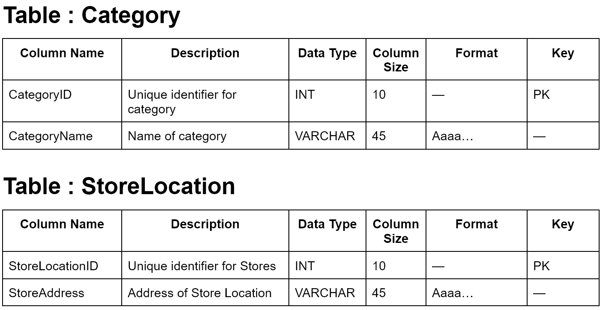
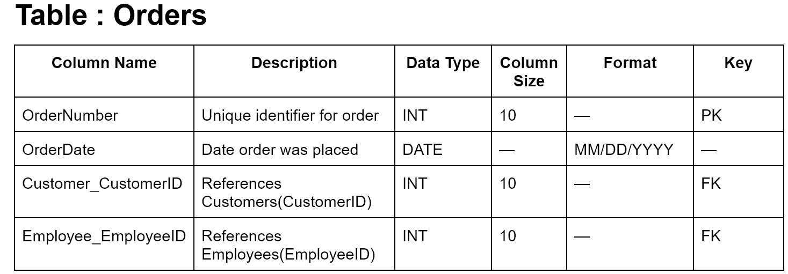
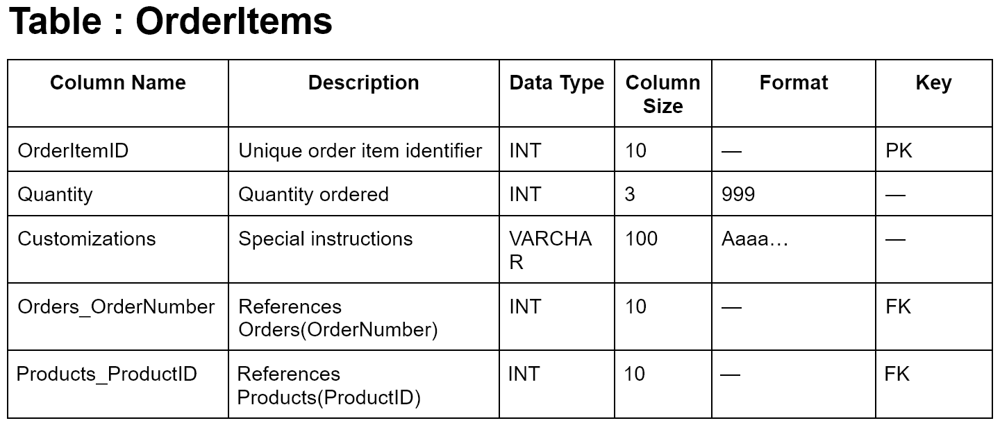
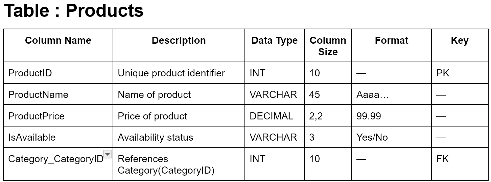

# MIST 4610 Group Project 1

## Group Members:

1. Donovan D'Silva - [repo](https://github.com/donmelsil/MIST4610_Group-Project)
2. Noah Hammond	- [repo](https://github.com/NoahHammond1/MIST4610_CoffeeShop_Project/tree/main)
3. Chase Lin - [repo](https://github.com/cinnamotz/mist4610gp1/tree/main)
4. Krithin Lokasani	- [repo](https://github.com/lokasanikrithin-source/GP1MIST2610)
5. Jessica Ngo - [repo](https://github.com/jn83499/Mist4610_Group-Project)

## Problem Description
We were assigned a task to model and build a relational database for the general operations of a coffee shop. The central entity in the model is the Orders entity, as it represents each transaction made by customers and serves as the core around which the rest of the system operates. Orders connect key components of the business, including customers, employees, products, and payments.

The coffee shop operates with related entities such as products (menu items), suppliers, and loyalty accounts, all supporting daily operations. Suppliers provide the necessary ingredients and inventory, while customer and order data allow the business to track consumer behavior and service interactions.

We are interested in accurately modeling these relationships, generating sample data, and populating the entities and their attributes. We aim to perform functional queries on this data to provide important and valuable business insights, such as identifying popular menu items, managing inventory needs, and supporting decision-making for purchasing and operational efficiency.
## Data Model

## Data Dictionary

## Queries
| Feature                     | Q1 | Q2 | Q3 | Q4 | Q5 | Q6 | Q7 | Q8 | Q9 | Q10 |
|----------------------------|----|----|----|----|----|----|----|----|----|-----|
| Multiple Table Join        | X  | X  |    | X  | X  |    | X  |    |    |     |
| Subquery                   | X  |    |    | X  |    |    |    |    |    |     |
| GROUP BY                   | X  | X  |    |    | X  | X  |    |    |    |     |
| GROUP BY with HAVING       | X  |    |    |    |    |    |    |    |    |     |
| Multi-condition WHERE      |    |    |    |  X |    |    |    |    |    |     |
| Built-in Functions         | X  | X  | X  |    |    | X  |    |    |    |     |
| REGEXP                     |    |    | X  |    |    |    |    |    |    |     |
| NOT EXISTS                 |    |    |    |    |    |    |    |    |    |     |
Query 4 lists the total revenue generated by credit card payments during 2026. The results are ordered in descending order of total revenue.

Query 4 helps managers identify which customers are making large purchases using only credit cards during the 2026 fiscal year. If they notice that most of these high-value transactions come from a small group of repeat customers, it suggests those customers are especially engaged and valuable to the business. With that insight, managers could consider introducing a premium rewards program or offering exclusive perks to these high-spending customers, encouraging them to stay loyal and potentially increasing overall transaction values across store locations.

Query 5 lists each store location alongside its total number of orders, total revenue generated, and average order value. The results are ordered in descending order of total revenue.

Query 5allows managers to compare the performances of each store location against each other in a multitude of ways. The ways are total orders, total revenue, and average order value. Total orders would allow managers to understand how many total orders are being processed by each store relative to their counterparts, to understand which locations are seeing more volume. Total revenue gives a little more of this understanding, by allowing managers to dissect even further into which stores are the most profitable. Average order value allows managers to better understand which stores are able to generate more value based on each individual order, possibly justifying raised prices or expanded premium offerings at certain locations.

## Database information
